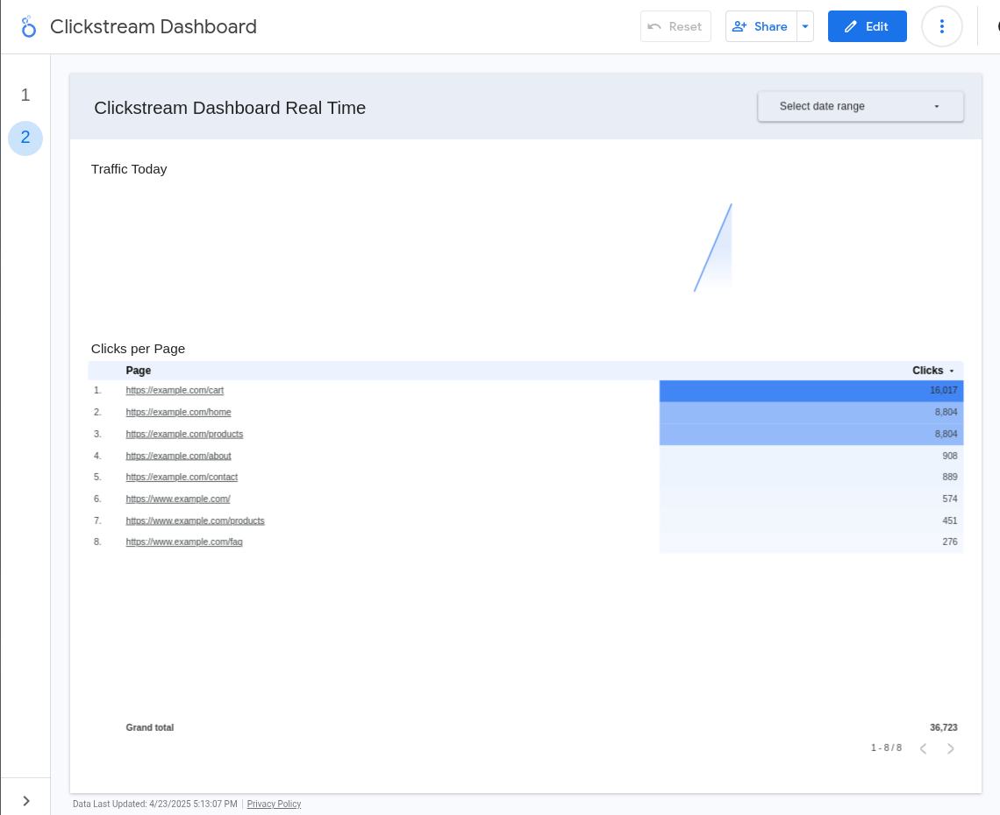

# DSL Clickstream - Task 3

This is another aproach for the code building and execution.
While Jupyter is great for experimentation, as we are now writing a
good chunck of code, and some parts of it can be reused, I opted to
properly organize the code from Task 2 into a more structured module
and allow for a more robust evolution of the project.

## Initial refactor of batch_pipeline.py

The fist refactor was to implement the code in a such a way there we
can more easily reuse the parsing and processing of raw view data.

The entrypoint is the same, however the code is now hosted under the
'clickstream' package.

To run a test on localhost (it will actually load data into BigQuery, tho):

```bash
export PROJECT_ID="$(gcloud config get-value project)"
python3 batch_pipeline.py
```

To run the pipeline on Google Cloud Dataflow:

```bash
export PROJECT_ID="$(gcloud config get-value project)"
python3 batch_pipeline.py \
    --runner=DataflowRunner \
    --setup=./setup.py \
    --project=$PROJECT_ID
```

With this aproach all the reusable dependencies will be packaged with the
pipeline artifacts and be made available to all workers on Cloud Dataflow,
as documented [here](https://cloud.google.com/dataflow/docs/guides/manage-dependencies#python-define-dependencies)

## Running the simulator

There is a streamming simulator that can be executed and it is possible to
use it as a way to generate messages for both unit testing and end-to-end
testing while developing.

To run the simulator from the command line, just use

```bash
python3 -m clickstream.simulator --visits-per-minute 60
```

The simulator class is also a Python module and you can import it to use
while creating messages.

## Push subscriber Cloud Function

In order to implement the Push Subscriber the aproach taken was to use
the Functions Framework and the PubSub Eventarc Trigger to acomplish the
task.

The first iterations were developed by using the TDD aproach and then
reusing the code from the `clickstream.parsers` package as well as adding
some helper functions to `clickstream.gcp` to stream data to Bigquery.

The major issue faced was related to the dependency management inside
Cloud Functions. It looks like there are several restrictions regarding
pre-compiled dependencies and some specific versions were required.

Additionally, we had to use the following aproach while deploying the
function:

1. Install the clickstream module in our virtual env as an editable source (pip install -e)
2. Create a vendor directory before deploying with all the dependencies (including
   our clickstream module). This allowed us to have a private dependency without
   the initial complexity to build/deploy multiple versions of the artifacts
   to a repository.

The second point was very important because it would slow down development
and testing cycles to have to deploy artifacts at this point.

The helper script [./pushsubscriber/deploy.sh](./pushsubscriber/deploy.sh)
was used for that pourpose.

## Looker Studio realtime Dashboard

Once the Cloud Function was deployed and using our simulator, it was easy to
develop the realtime part of the dashboard. We already have the data ready
and optimized for analytics, so we just created a second page in the report
that shows the click per page as requested and configured the auto-refresh
part of the report to make easier to view that information.




## Pull Subscriber

The pull subscriber could reuse some of the parsing and streaming insert
code that we had previously.

The challenge was to actually come up with a way to both run the pull loop
AND run the HTTP service that monitors the execution of this loop.

Without having to dive into the insanity of writing threading code in Python
(and the even more insanity of debugging it) we opted to build something
simpler, using the `subprocess` module.

We packaged the code using Dockerfile to make it easier to build and test,
but authentication would be a bit tricky to get right from inside the VM.

NOTE: the task to actually run the program on a cluster of VMs was left to
the end as it is quite a chore and will not add much to the Data Engineering
part of the things.
